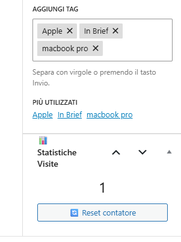
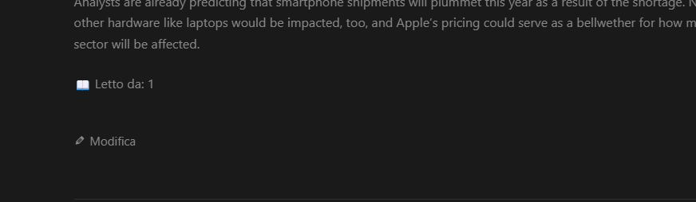

# 🧮 Mio Visit Counter

**Un plugin WordPress semplice, leggero e senza pubblicità per contare le visite dei tuoi post.**
---


---

## 🎯 Descrizione
Simple Visit Counter è nato da un'esigenza semplice: avere un contatore visite pulito, senza pubblicità, senza versioni pro, senza tracciamenti esterni. Tutto rimane nel tuo database WordPress, tutto è sotto il tuo controllo.


## Perfetto per:

- 📝 Blogger che vogliono mostrare la popolarità dei propri articoli

- 👨‍💻 Sviluppatori che cercano una soluzione leggera e personalizzabile

- 🏢 Siti che non vogliono dipendenze da servizi esterni
---

## ✨ Caratteristiche
- Funzionalità	Descrizione

- 🚀 Leggerissimo	Una sola riga nel database, zero chiamate esterne
- 🔒 Privacy by design	Nessun tracciamento, nessun cookie, nessun servizio esterno
- 🎨 Personalizzabile	Shortcode flessibile con parametri
- 🛡️ Anti-bot	Rilevamento base di crawler e spider
- 🧠 Anti-refresh	Non conta refresh multipli nella stessa sessione
- 📊 Meta box	Visualizza le visite direttamente nell'editor
- 🔧 Reset facile	Gli admin possono resettare il contatore con un click
- 🌐 Pronto per la cache	Funziona perfettamente con plugin di caching
- 📦 Installazione


## Metodo 1: Download manuale
Scarica l'ultima versione da GitHub

Carica la cartella mio-visit-counter in /wp-content/plugins/

Vai in Plugin → Plugin installati e attiva "Mio Visit Counter"

## Metodo 2: Da WordPress.org (in arrivo)
Prossimamente disponibile direttamente dal repository ufficiale WordPress.

## 🎮 Utilizzo
Shortcode base
php
[visite]
Mostra: 👁️ Visualizzazioni: es.1.234

Shortcode personalizzato
php
[visite testo="📖 Letto da:"]
Mostra: 📖 Letto da: es.1.234

Mostra solo dopo un certo numero
php
[visite mostra_solo_se="100"]
Mostra il contatore solo se ha superato le 100 visite.


## Messaggio personalizzato se zero visite
php
- [visite nessun_dato="Sei il primo a leggere questo articolo!"]
Mostra il messaggio personalizzato se non ci sono ancora visite.
---
## In un template PHP
```php
<?php echo do_shortcode('[visite]'); ?>
Con stile CSS personalizzato
css
.svc-counter {
    display: inline-block;
    padding: 5px 12px;
    background: #f8f9fa;
    border-radius: 20px;
    font-size: 0.9em;
    color: #2c3e50;
    border: 1px solid #e9ecef;
}
```

## ⚙️ Come funziona
Il plugin utilizza i post meta di WordPress per memorizzare il numero di visite.

## Logica di conteggio
✅ Controlla che sia un singolo post

✅ Verifica che non sia un bot/crawler

✅ Esclude admin ed editor (opzionale)

✅ Controlla la sessione per evitare refresh multipli

✅ Incrementa il contatore

✅ Salva nel database

## 🛡️ Privacy e GDPR
✅ Nessun dato personale viene raccolto

✅ Nessun cookie viene impostato

✅ Nessun servizio esterno viene contattato

✅ I dati rimangono sul tuo server, nel tuo database WordPress

✅ Puoi cancellare tutti i dati semplicemente disattivando il plugin

## 📊 Screenshot
Meta box nell'editor

Il contatore è visibile direttamente nella schermata di modifica del post

Shortcode nel frontend

Il contatore mostrato nel post con stile personalizzato

## 🔧 Per sviluppatori
- Filtri disponibili
```php
php
// Modifica la lista dei bot da ignorare
add_filter('svc_bot_list', function($bots) {
    $bots[] = 'mia-identificazione-bot';
    return $bots;
});

// Escludi ruoli specifici dal conteggio
add_filter('svc_exclude_roles', function($roles) {
    $roles[] = 'editor';
    return $roles;
});
Azioni disponibili
php
// Esegui qualcosa dopo un reset
add_action('svc_after_reset', function($post_id) {
    error_log("Contatore resettato per il post $post_id");
});
Funzioni PHP
php
// Ottieni visite di un post via PHP
$visite = svc_get_visite(123); // Restituisce il numero di visite per il post ID 123
```
---
## 🐛 Segnalazione problemi
Se trovi un bug o hai un suggerimento:

Apri una issue su GitHub

Descrivi il problema (e come riprodurlo)

Indica la versione di WordPress e PHP

## 📝 Changelog
1.0.0 - 2026-03-10
🎉 Prima release pubblica

✨ Shortcode flessibile con parametri

🛡️ Rilevamento base bot

📊 Meta box nell'editor

🔧 Reset contatore via AJAX

🌐 Supporto multilingua (pronto per traduzioni)

## 📜 Licenza
GPLv2 o successiva - Questo plugin è software libero. Puoi ridistribuirlo e/o modificarlo secondo i termini della GNU General Public License come pubblicata dalla Free Software Foundation.

## 👨‍💻 Autore:
Sergio Cornacchione

🌐 www.seconet.it


# ⭐ Supporto il progetto
Se il plugin ti è utile:

Lascia una ⭐ su GitHub

Condividi il progetto con altri blogger

Offrimi un caffè !

🤝 Contribuire
Le pull request sono benvenute! Per modifiche importanti, apri prima una issue per discutere cosa vorresti cambiare.

Fork del progetto

Crea il tuo branch (git checkout -b feature/AmazingFeature)

Commit delle modifiche (git commit -m 'Add some AmazingFeature')

Push al branch (git push origin feature/AmazingFeature)

Apri una Pull Request
